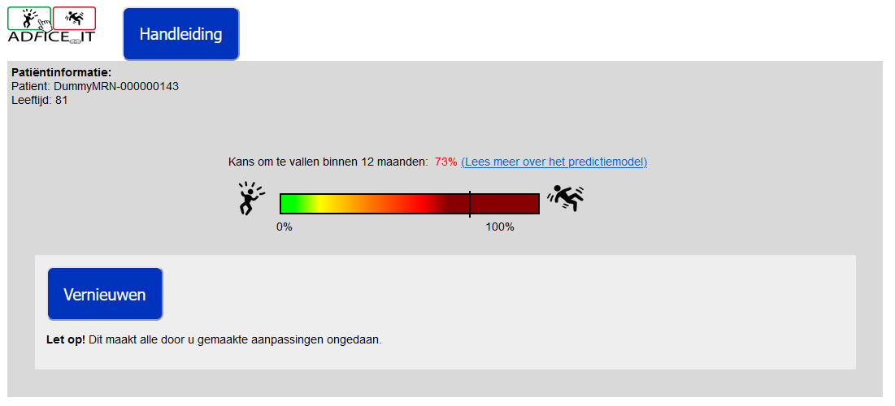
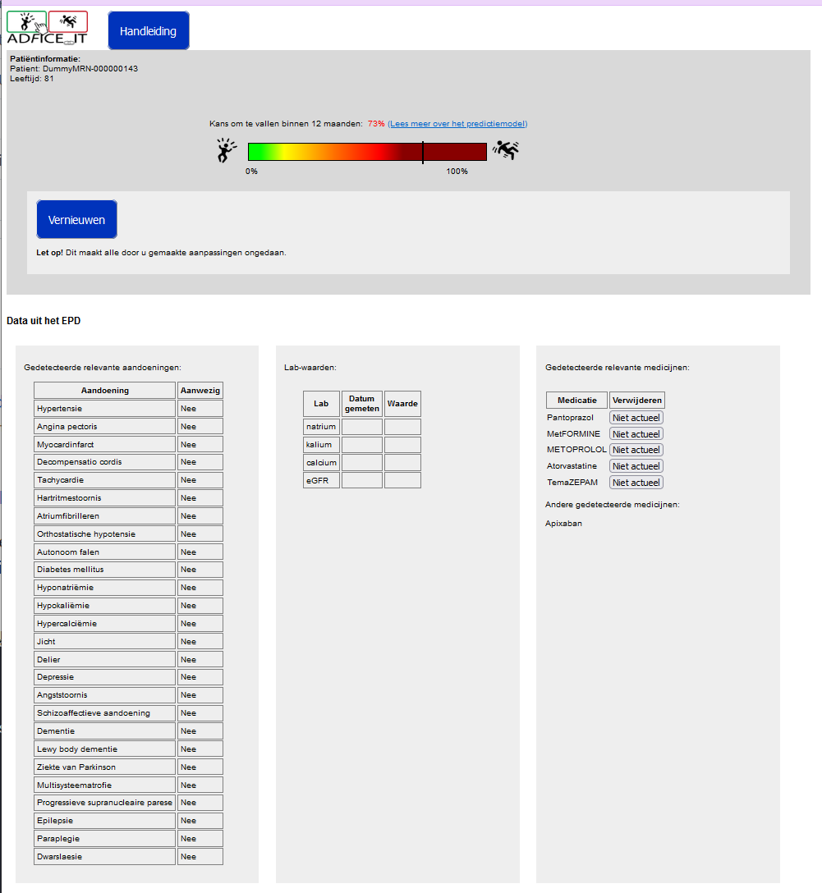
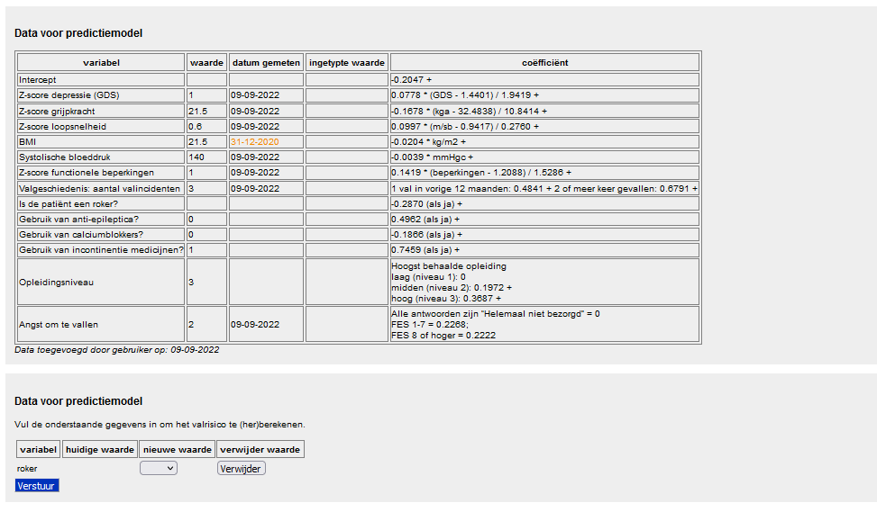
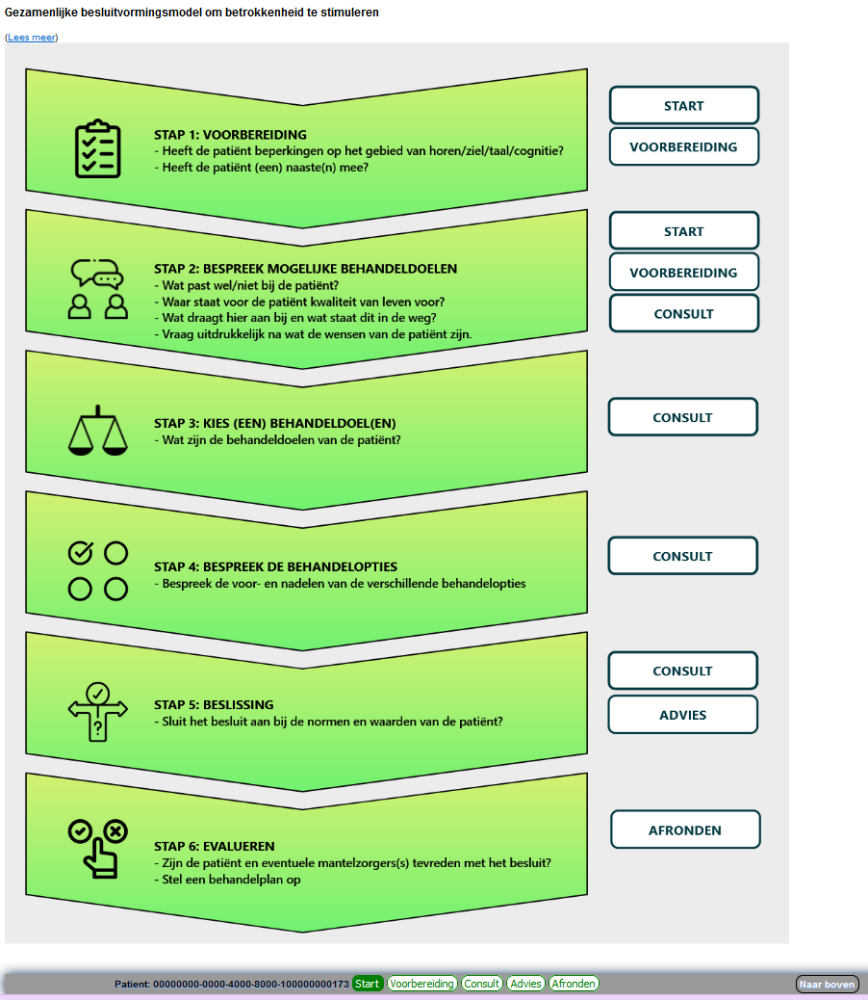
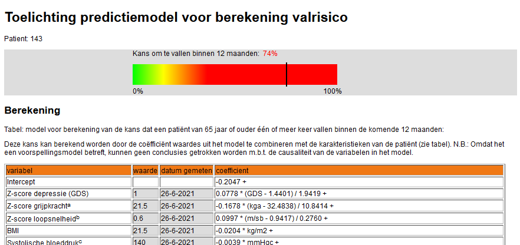
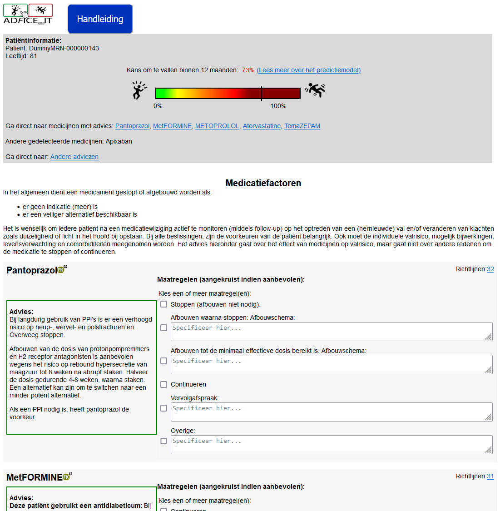
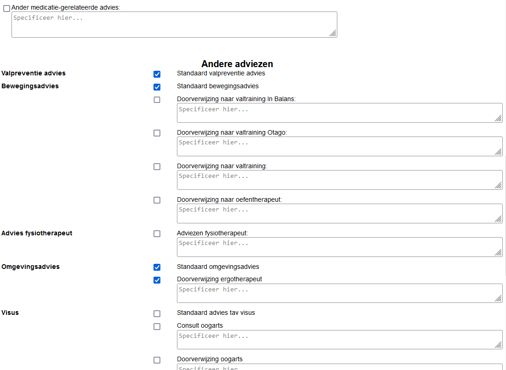
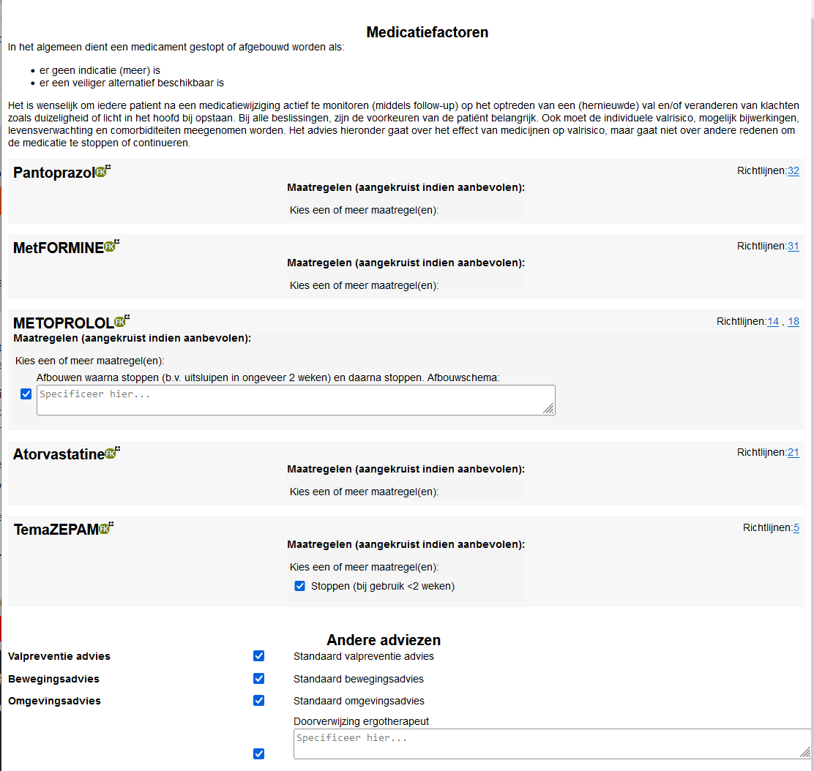
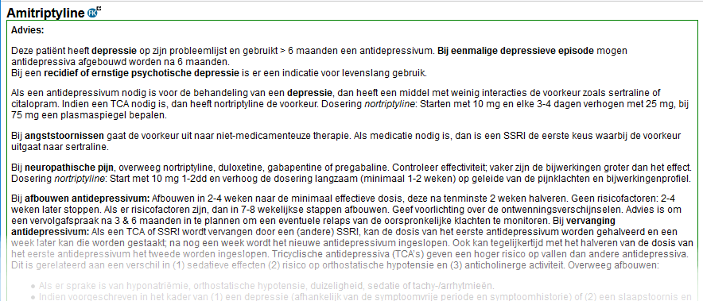
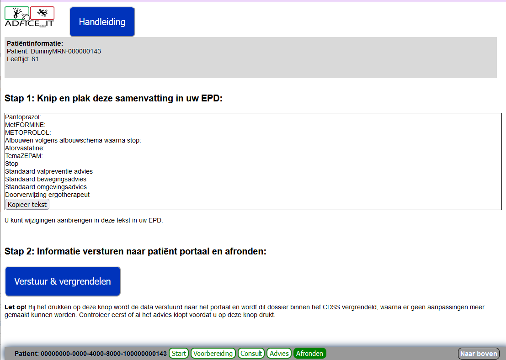

# adfice-ace

The purpose of the system is to evaluate patient data using guideline-based rules and produce a summary of guideline recommendations for medications relating to falls.

**The system is currently under development and does not have a CE mark.**

The source code and documentation is provided in the interests of transparency and research integrity. This information is not intended to be used to make medical decisions. The CAREFREE and ADFICE_IT research projects plan to implement and test a system using this source code and documentation.

<h2>System description</h2>
The system has 3 main functions:
1. Provide a prediction of fall risk based on the prediction model developed by van der Loo et al (2021).
2. For each medication that the patient is taking, provide a summary of guideline-based advice related to that medication, tailored based on specific patient characteristics. Provide a list of possible actions regarding this medication (e.g. stop, reduce dose, continue, etc.). The clinician can choose from these options, or fill in a free text box with other instructions.
3. Provide access to the information from commonly-used patient handouts, in convenient printable format.

Each of these is described in more detail below:

At the top of the page, the clinician can see the patient's fall risk represented in graphical form. By clicking on the "lees meer..." link, the clinician can access the information page about the prediction model (see below). The user can also open the Handbook (Handleiding) and, if needed, reload the data from the EHR.

The main purpose of the start page is to let the user check the data that is pulled in from the patient record. It shows which of the patient's medications are possible Fall-Risk-Increasing Drugs, as well as medications detected by the system that are not FRIDs. This allows the doctor to check whether the system has successfully retrieved all of the patient's medications from the patient record. (Errors in the way medications are documented or coded in the patient record can mean that the system is unable to detect some medications. The doctor needs to be aware of this so they can distinguish between "no data" and "no advice." The header also shows which of the patient's problem list items and which laboratory values are being detected and considered by the system. This also helps the clinician understand the limitations of the system's reasoning, so they can weigh the advice appropriately in their decision-making. If they wish to add data to the patient record and reload to get new advice, they can use the button at the top of the page to do this.

The clinician can also check the data pulled in for use by the prediction model, and if needed, add data that is not pulled in.

Finally, there is a brief guide to shared decision-making. This is intended as a quick graphical reminder of the steps that will be taken with every consult.

Note the control bar at the bottom - this allows the clinician to navigate between the pages.

The prediction model explanation page explains exactly how the prediction is calculated, and gives information on how the model was developed and validated.

The Preparation page contains a list of the patient's medications, with advice for each medication. This advice is tailored based on the patient's characteristics: For example, if system detects a diagnosis of depression in the patient's history, it will give more detailed information about the use of amitryptiline to treat depression. It also gives information about other possible uses - there's always the chance that the patient is taking the mediation for another problem that isn't documented. 

Following the advice box, there are links to the references used in formulating the advice. These give the actual quotations from the guidelines that were the basis of the advice.

Then there are a series of checkbox options listing possible follow-up actions that the clinician could take for this medication. There is always a free text box at the bottom, so the clinician can give instructions that are not included among the checkboxes. 

Information that is commonly provided in handouts can be selected by the clinician using the checkboxes in the "other advice" section. This allows the clinician to provide a convenient, patient-friendly summary of all recommendations in one place.

The Consult view gives a compact view of the options that were selected in the checkboxes on the previous page. This gives the clinician a handy place to go over the options with the patient, and make the final selection of choices.

Each checkbox that the doctor selects will result in accompanying text appearing in the patient-friendly view. The doctor can go over this information with the patient, print a copy for the patient to take home.

Finally, the Finalize page gives the doctor a convenient summary of the checkboxes that were selected to copy-paste into the patient record. When everything is finalized, the doctor can click the "send to portal" button to release the recommendations to the Fall Portal. Once the information is released to the portal, it can no longer be changed, to prevent possible discrepiencies between the information the patient read and the information stored in the system.

The patient can review the information whenever they like, from the print-out or (for internet-savvy seniors) in the portal.
